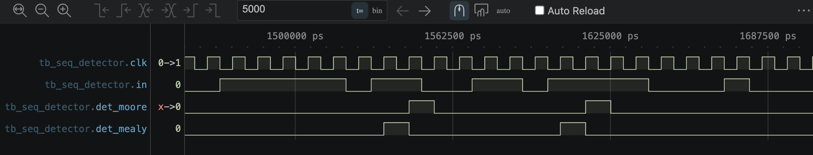
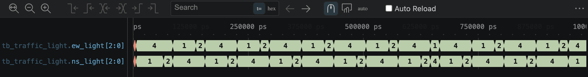
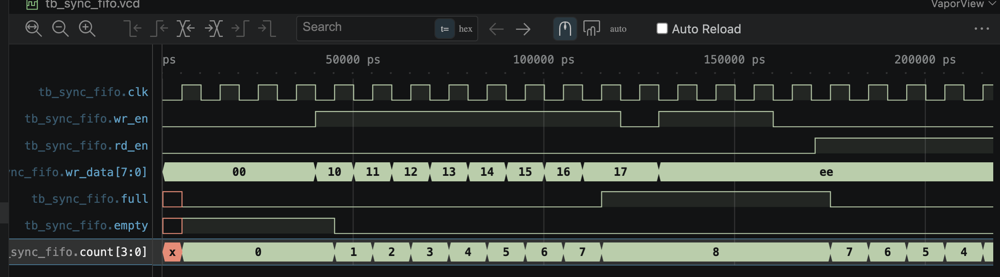

# verilog-basics

Digital design fundamentals in Verilog-2001 — combinational and sequential building
blocks, each written from scratch and verified with a self-checking testbench.

Simulated with Icarus Verilog (`iverilog` + `vvp`), waveforms inspected in a VCD viewer.

## Day 1 — Gates & Basic Modules

| Module | File | Description |
|---|---|---|
| `and_gate` | `and_gate.v` | Basic gate-level module, first simulation flow |
| `mux2_1bit` | `mux2_1bit.v` | 1-bit 2-to-1 multiplexer |

## Day 2 — Combinational Logic & Module Hierarchy

| Module | File | Description |
|---|---|---|
| `mux2` / `mux4` | `mux4.v` | 8-bit 4-to-1 multiplexer built hierarchically from three 2-to-1 mux instances |
| `decoder3to8` | `decoder3to8.v` | 3-to-8 one-hot decoder with active-high enable; `always @(*)` with a fully covered `case` (no inferred latches) |
| `full_adder` / `ripple_carry_adder` | `ripple_carry_adder.v` | Parameterized N-bit ripple-carry adder built with a `generate` loop over full-adder instances |

| Testbench | Strategy | Vectors | Result |
|---|---|---|---|
| `tb_mux4.v` | directed + constrained random | 104 | PASS |
| `tb_decoder3to8.v` | exhaustive (full input space) | 16 | PASS |
| `tb_ripple_carry_adder.v` | directed corner cases + random vs. reference model | 509 | PASS |


## Day 3 — Sequential Logic

Clocked building blocks, each verified against a behavioural reference model running
in parallel with the DUT and compared every cycle.

| Module | File | Description |
|---|---|---|
| `d_ff` | `dff.v` | D flip-flop with **synchronous** reset |
| `d_ff_async` | `dff.v` | D flip-flop with **asynchronous** reset |
| `d_ff_en` | `dff.v` | D flip-flop with clock enable |
| `shift_reg8` | `shift_reg8.v` | 8-bit serial-in shift register with enable, parallel and serial outputs |
| `counter_mod10` | `counter_mod10.v` | Decade counter (0–9) with enable and a wrap `tick` output |

| Testbench | What it checks | Result |
|---|---|---|
| `tb_dff.v` | Cycle-by-cycle match against three reference models, plus a directed test where a short reset pulse falls entirely between two clock edges — the synchronous flip-flop must ignore it, the asynchronous one must not | PASS |
| `tb_shift_reg8.v` | Reference-model match, an end-to-end test shifting a known 8-bit pattern in one bit at a time, and a freeze test with `en` deasserted | PASS |
| `tb_counter_mod10.v` | Reference-model match, the invariant that `count` never leaves 0–9, exact `tick` placement, and tick count over three full wraps | PASS |

Each testbench generates a 100 MHz clock. Stimulus is applied on the falling edge to
stay clear of the active edge and avoid races between driving and sampling.


## Running

```bash
make all        # compile + simulate everything
make day2       # combinational blocks only
make day3       # sequential blocks only
make counter    # a single module
```

## Design notes

- Ripple-carry delay grows linearly with N — the carry chain is the critical path.
  Faster adders (carry-lookahead, carry-select) trade area for delay using the
  generate/propagate formulation `c[i+1] = g[i] | (p[i] & c[i])`.
  The adder is reused as the arithmetic core of the ALU and of the single-cycle CPU project.
- Every clocked block uses non-blocking assignment (`<=`); every combinational block uses
  blocking (`=`). Mixing them changes the synthesized hardware without any compiler warning.
- Asynchronous reset is asserted immediately but must be de-asserted synchronously in real
  designs (a reset synchronizer) to avoid flip-flops leaving reset on different cycles.
- `tick` is combinational rather than registered, so it lines up with the count value that
  produces it instead of lagging a cycle behind.
- Ports are connected by name, never by position.

## Tools

`Icarus Verilog` · `VCD waveform viewer` · `make` · `Git`

## Day 4 — Finite State Machines

Both designs use the standard three-block FSM style: a clocked state register, a
combinational next-state block, and a combinational output block. Every `case` has a
`default` branch so the machine can always recover from an unreachable state.

| Module | File | Description |
|---|---|---|
| `seq_detector_moore` | `seq_detector.v` | Detects the overlapping sequence `1011`. Moore style — output depends on state only, five states |
| `seq_detector_mealy` | `seq_detector.v` | Same detector, Mealy style — output depends on state *and* input, four states, asserts one cycle earlier |
| `traffic_light` | `traffic_light.v` | Parameterized four-phase intersection controller with timed transitions and a fail-safe all-red default |

| Testbench | What it checks | Result |
|---|---|---|
| `tb_seq_detector.v` | Both FSMs run in parallel on the same bit stream, compared against a reference model that tracks the last four sampled bits. The directed stream `1011011011` must produce exactly three overlapping detections; near-misses, reset mid-sequence and 400 random bits follow | PASS |
| `tb_traffic_light.v` | Safety invariants every cycle (lights one-hot, never two greens, one direction always red), plus phase order and duration measured across three full cycles, plus recovery from a mid-run reset | PASS |

Mealy asserts one cycle before Moore — same detection, different contract:



Phase sequence: green → yellow → the other direction. One side is always red:



### Design notes

- After a failed match the detector does **not** return to the initial state — it falls
  back to the longest suffix of what it has seen that is still a prefix of `1011`.
  Resetting to the start would miss overlapping matches. Same reasoning as the KMP
  failure table.
- Moore output is glitch-free because it changes only on a clock edge, at the cost of an
  extra state and one cycle of latency. Mealy reacts in the same cycle but puts the input
  directly in the output path.
- The traffic light's `default` branch drives red in both directions, so an unreachable
  state stops the intersection rather than opening it.
- State encoding is binary here. On an FPGA one-hot is usually preferred — flip-flops are
  cheap, and comparing a single bit is faster than decoding a binary value.

## Day 5 — ALU and Synchronous FIFO

| Module | File | Description |
|---|---|---|
| `alu` | `alu.v` | Parameterized 8-operation ALU: ADD, SUB, AND, OR, XOR, SLT, SLL, SRL, with zero / negative / carry / signed-overflow flags |
| `sync_fifo` | `sync_fifo.v` | Parameterized synchronous FIFO built as a circular buffer, with full / empty / count and single-cycle simultaneous read and write |

### Verification

| Testbench | Strategy | Cases | Result |
|---|---|---|---|
| `tb_alu.v` | **Exhaustive** — every operation against every possible operand pair, compared to an independent reference model | 524,288 | PASS |
| `tb_sync_fifo.v` | Independent queue model (own array, head, tail and counter) checked every cycle, plus directed overflow / underflow / simultaneous-access scenarios and 800 cycles of random traffic | — | PASS |

The ALU sweep covers the entire input space, so there is no coverage gap to argue
about: `8 operations × 256 × 256`, no sampling and no assumptions.

### Design notes

- **One adder does both ADD and SUB.** Subtraction is `a + ~b + 1`; the `+1` costs
  nothing because it rides in on the adder's existing carry-in. `b` is inverted
  conditionally with `b ^ {N{sub_mode}}` — XOR with all-ones inverts, with all-zeros
  passes through.
- **Carry and overflow are different flags.** `0x7F + 0x01` produces no carry but does
  overflow: correct as unsigned 128, wrong as signed −128. The hardware exposes both and
  lets the software decide which one it cares about.
- **Signed comparison is `sum[N-1] ^ overflow`.** The sign bit alone is unreliable,
  because overflow inverts it. This is how MIPS implements `slt`, and it removes the need
  for a separate comparator.
- **Carry and overflow are forced low for the logic and shift operations.** The adder runs
  in parallel regardless, but its carry-out is meaningless for AND — defined behaviour is
  better than accidental behaviour.
- **The FIFO pointers carry one extra bit.** Empty and full are the same pointer
  comparison otherwise; the extra bit counts laps, so equal addresses with equal lap bits
  means empty and equal addresses with different lap bits means full. `count` is a plain
  subtraction — modular arithmetic handles the wraparound with no special case.
- **Read and write are two independent `if` statements, not `if/else`.** Doing both in one
  cycle is the normal case for a FIFO under load; using `else` would halve the throughput.


