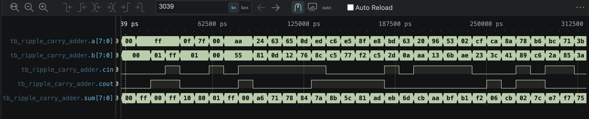
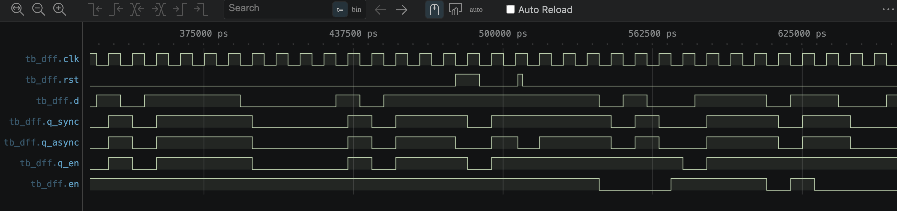

# verilog-basics

Digital design fundamentals in Verilog-2001 — combinational and sequential building
blocks, each written from scratch and verified with a self-checking testbench.

Simulated with Icarus Verilog (`iverilog` + `vvp`), waveforms inspected in a VCD viewer.

## Day 1 — Gates & Basic Modules

| Module | File | Description |
|---|---|---|
| `and_gate` | `and_gate.v` | Basic gate-level module, first simulation flow |
| `mux2_1bit` | `mux2_1bit.v` | 1-bit 2-to-1 multiplexer |

## Day 2 — Combinational Logic & Module Hierarchy

| Module | File | Description |
|---|---|---|
| `mux2` / `mux4` | `mux4.v` | 8-bit 4-to-1 multiplexer built hierarchically from three 2-to-1 mux instances |
| `decoder3to8` | `decoder3to8.v` | 3-to-8 one-hot decoder with active-high enable; `always @(*)` with a fully covered `case` (no inferred latches) |
| `full_adder` / `ripple_carry_adder` | `ripple_carry_adder.v` | Parameterized N-bit ripple-carry adder built with a `generate` loop over full-adder instances |

| Testbench | Strategy | Vectors | Result |
|---|---|---|---|
| `tb_mux4.v` | directed + constrained random | 104 | PASS |
| `tb_decoder3to8.v` | exhaustive (full input space) | 16 | PASS |
| `tb_ripple_carry_adder.v` | directed corner cases + random vs. reference model | 509 | PASS |



## Day 3 — Sequential Logic

Clocked building blocks, each verified against a behavioural reference model running
in parallel with the DUT and compared every cycle.

| Module | File | Description |
|---|---|---|
| `d_ff` | `dff.v` | D flip-flop with **synchronous** reset |
| `d_ff_async` | `dff.v` | D flip-flop with **asynchronous** reset |
| `d_ff_en` | `dff.v` | D flip-flop with clock enable |
| `shift_reg8` | `shift_reg8.v` | 8-bit serial-in shift register with enable, parallel and serial outputs |
| `counter_mod10` | `counter_mod10.v` | Decade counter (0–9) with enable and a wrap `tick` output |

| Testbench | What it checks | Result |
|---|---|---|
| `tb_dff.v` | Cycle-by-cycle match against three reference models, plus a directed test where a short reset pulse falls entirely between two clock edges — the synchronous flip-flop must ignore it, the asynchronous one must not | PASS |
| `tb_shift_reg8.v` | Reference-model match, an end-to-end test shifting a known 8-bit pattern in one bit at a time, and a freeze test with `en` deasserted | PASS |
| `tb_counter_mod10.v` | Reference-model match, the invariant that `count` never leaves 0–9, exact `tick` placement, and tick count over three full wraps | PASS |

Each testbench generates a 100 MHz clock. Stimulus is applied on the falling edge to
stay clear of the active edge and avoid races between driving and sampling.



## Running

```bash
make all        # compile + simulate everything
make day2       # combinational blocks only
make day3       # sequential blocks only
make counter    # a single module
```

## Design notes

- Ripple-carry delay grows linearly with N — the carry chain is the critical path.
  Faster adders (carry-lookahead, carry-select) trade area for delay using the
  generate/propagate formulation `c[i+1] = g[i] | (p[i] & c[i])`.
  The adder is reused as the arithmetic core of the ALU and of the single-cycle CPU project.
- Every clocked block uses non-blocking assignment (`<=`); every combinational block uses
  blocking (`=`). Mixing them changes the synthesized hardware without any compiler warning.
- Asynchronous reset is asserted immediately but must be de-asserted synchronously in real
  designs (a reset synchronizer) to avoid flip-flops leaving reset on different cycles.
- `tick` is combinational rather than registered, so it lines up with the count value that
  produces it instead of lagging a cycle behind.
- Ports are connected by name, never by position.

## Tools

`Icarus Verilog` · `VCD waveform viewer` · `make` · `Git`
